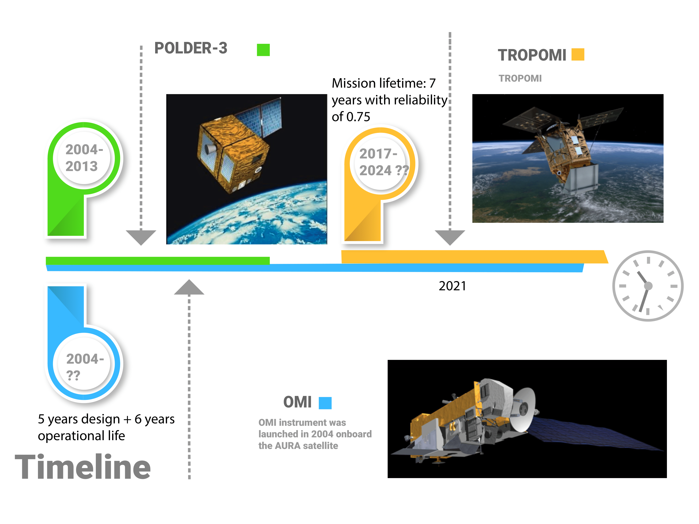

# Machine learning for Aerosol Classication
AE Thesis for aerosol classification from the satellite data. TROPOMI, POLDER and OMI are the satellite data that will be used. The repository includes python scripts and some R files. 

Below is the time of the satellite missions under consideration. 

## Installation Files

> pip install python

## Downloading the Satellite Data

The following code can be used to download the satellite data.

